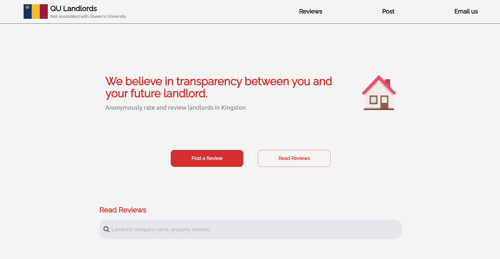

# qulandlords.com

## Overview

QU-Landlords is a full-stack web application designed for users to write and submit reviews about landlords or property management companies in Kingston, Ontario. This application is built using the MERN stack - MongoDB, Express.js, React, and Node.js.

## Features

- Write reviews including details such as landlord name, property address, and rent amount.
- Rate the reliability of landlords/companies and provide recommendations.
- View submissions in a user-friendly interface.
- The submission process is anonymous to encourage honest reviews.

## Tech Stack

- **Frontend**: React (Create React App)
- **Backend**: Node.js with Express.js
- **Database**: MongoDB (Mongoose ODM)
- **Styling**: Tailwind CSS
